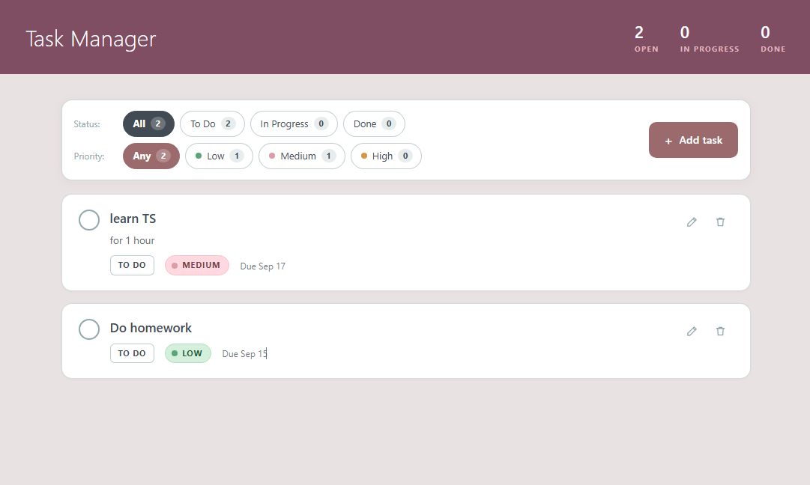

# Task Manager

A simple task manager app: create, edit, and filter tasks by status and priority. Fully client-side, all data is stored in the browser's `localStorage`.

## Stack

- React 19 + TypeScript
- Vite
- Tailwind CSS
- react-hook-form + zod (forms and validation)

## Features

- Create, edit, and delete tasks
- Status: To Do / In Progress / Done
- Priority: Low / Medium / High
- Due dates with overdue task highlighting
- Filter the list by status and priority at the same time

## Screenshot



## Getting Started

```bash
npm install
npm run dev
